# Pieces
## leg-piece-b
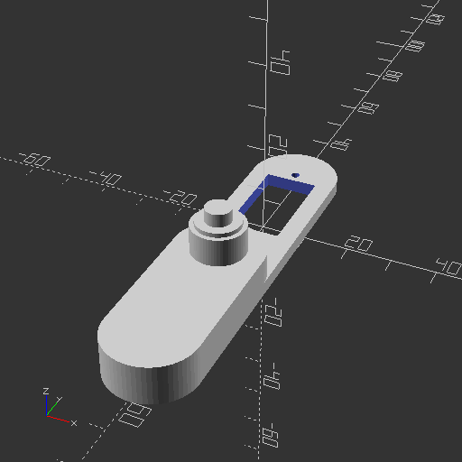

## body-piece-a
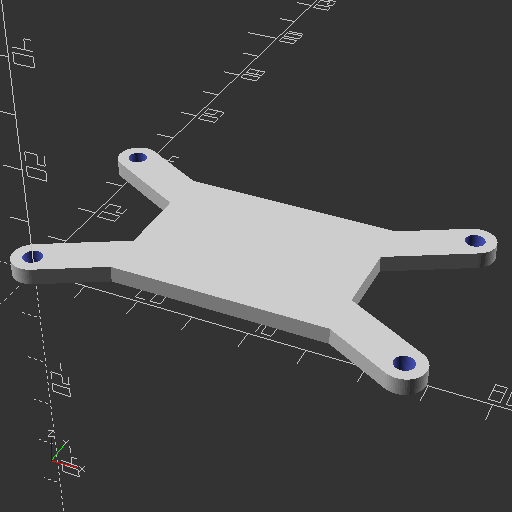

## hip-piece-d
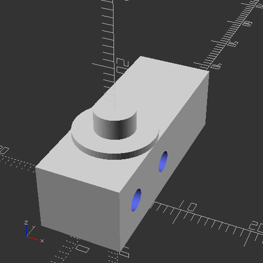

## hip-piece-a
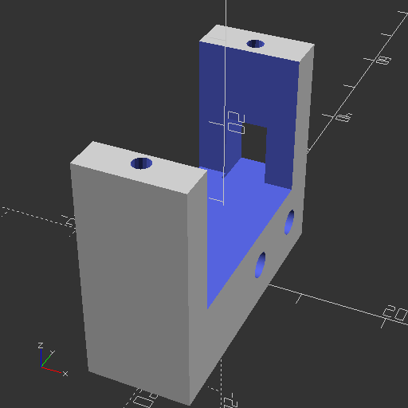

## leg-piece-e
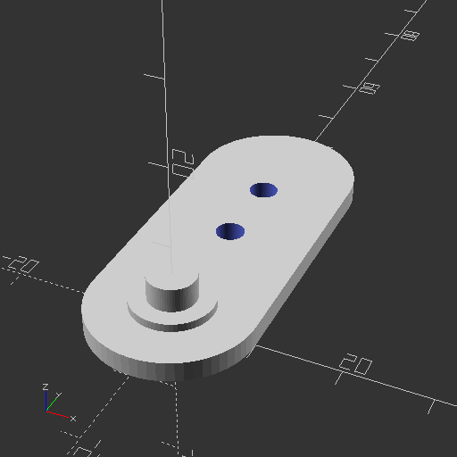

## hip-piece-b

## body-piece-a-1
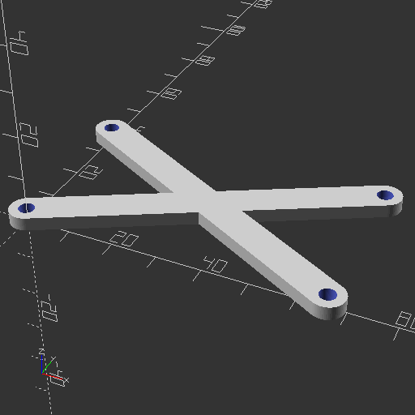

## leg-piece-c
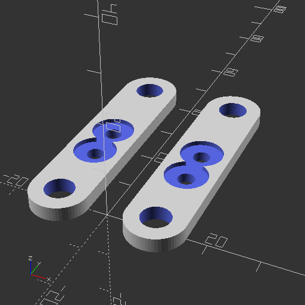

## hip-support-piece-c
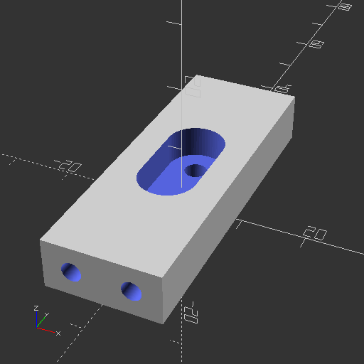

## body-piece-c

## body-piece-b
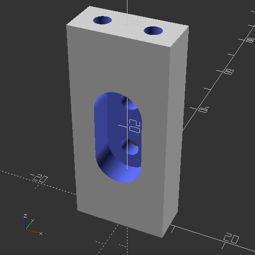

## hip-support-piece-a
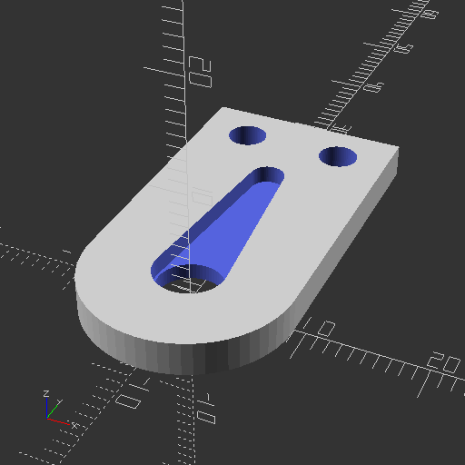

## leg-piece-d
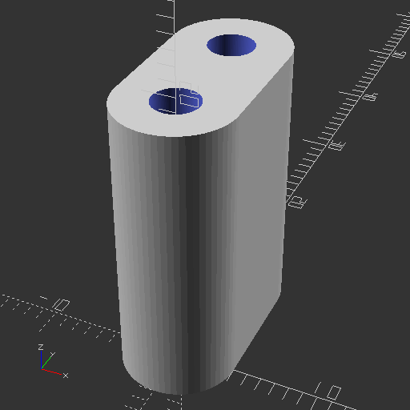

## leg-piece-a
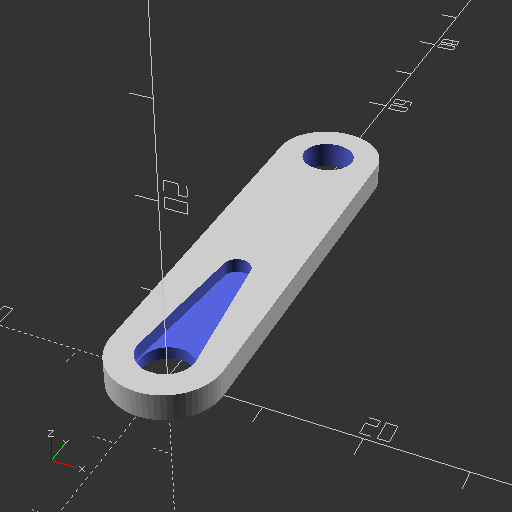

## hip-piece-c
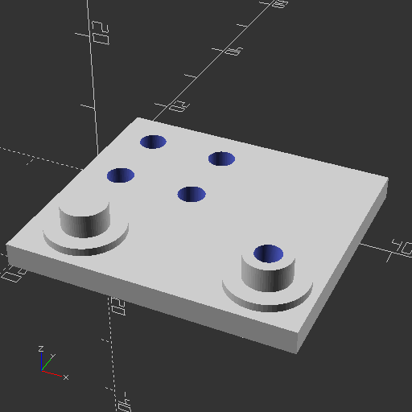

## hip-support-piece-b

