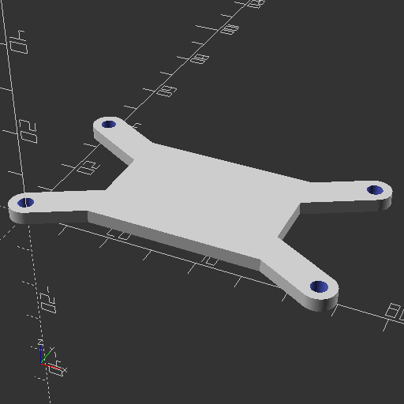

# Pieces
## legPieceB

## body-piece-a

## hipPieceD

## hipPieceA

## legPieceE

## hipPieceB

## bodyPieceA1

## legPieceC

## hipSupportPieceC

## bodyPieceC

## bodyPieceB

## hipSupportPieceA

## legPieceD

## legPieceA

## hipPieceC

## hipSupportPieceB

