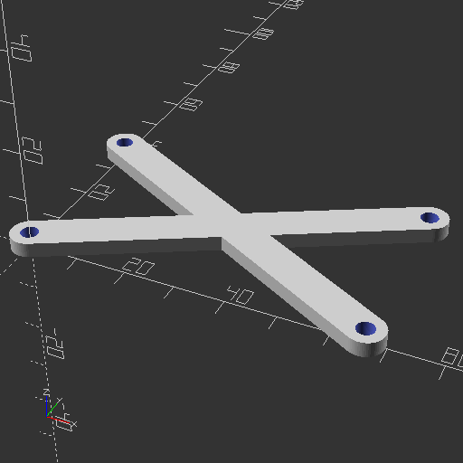
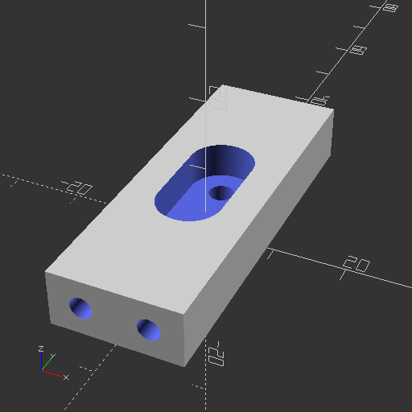
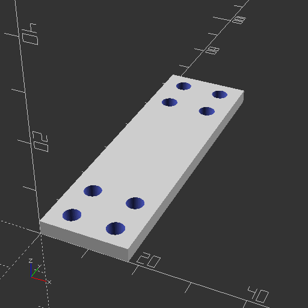
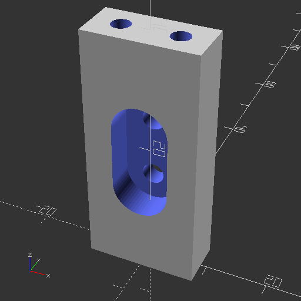
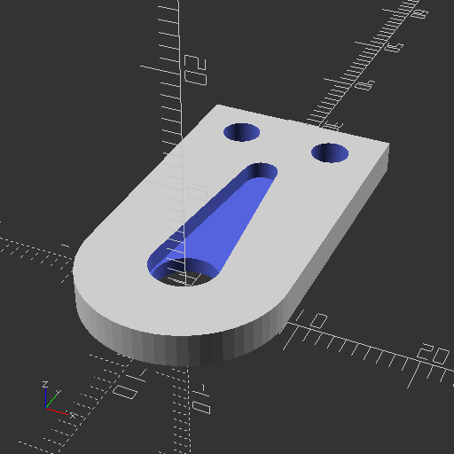
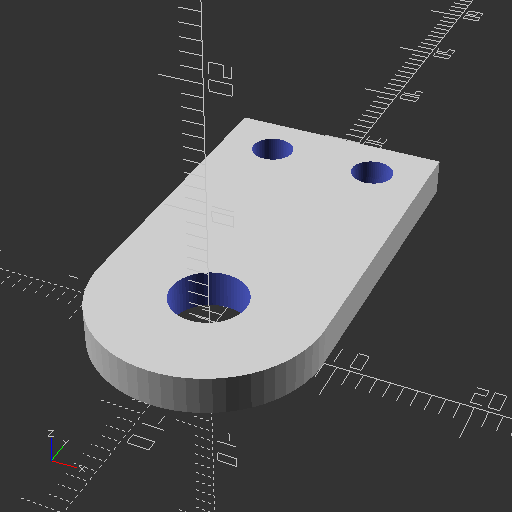

# Pieces
## legPieceB

## body-piece-a

## hipPieceD

## hipPieceA

## legPieceE

## hipPieceB

## body-piece-a-1

## legPieceC

## hip-support-piece-c

## body-piece-c

## body-piece-b

## hip-support-piece-a

## legPieceD

## legPieceA

## hipPieceC

## hip-support-piece-b

