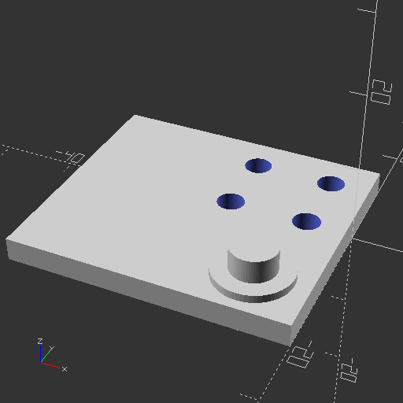
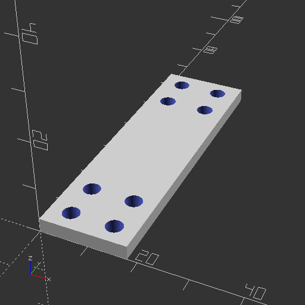
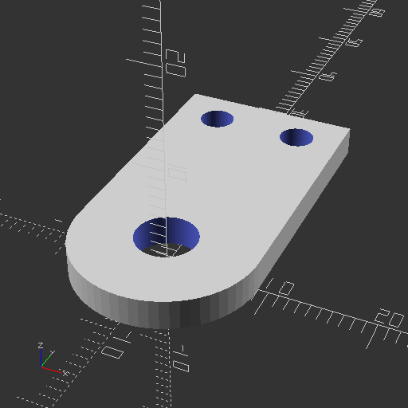

# Pieces
## leg-piece-b

## body-piece-a

## hip-piece-d

## hip-piece-a

## leg-piece-e

## hip-piece-b

## body-piece-a-1

## leg-piece-c

## hip-support-piece-c

## body-piece-c

## body-piece-b

## hip-support-piece-a

## leg-piece-d

## leg-piece-a

## hip-piece-c

## hip-support-piece-b

